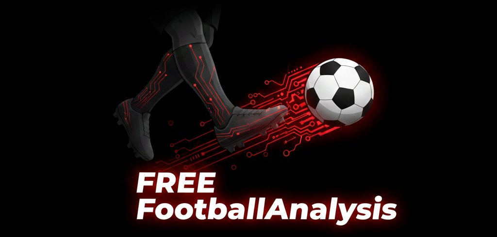

<a name="readme-top"></a>

<!-- PROJECT LOGO -->
<div align="center">
  
  
  <h1 align="center">⚽ FREE Football Analysis</h1>
  
  <p align="center">
    <strong>Automated football match analysis using Computer Vision & Deep Learning</strong>
  </p>
  
  <p align="center">
    
    
    
    
  </p>
  
  <p align="center">
    <strong>Author:</strong> <a href="https://github.com/MrPatchara" style="color: #DC143C;">Patchara Al-umaree</a>
    <br />
    <br />
    <a href="https://github.com/MrPatchara/football-computer-vision/issues" style="color: #DC143C;">🐛 Report Bug</a>
    ·
    <a href="https://github.com/MrPatchara/football-computer-vision/issues" style="color: #DC143C;">💡 Request Feature</a>
  </p>
  
  <br />
</div>


<!-- ABOUT THE PROJECT -->
## 📖 About The Project

<div align="center">

**FREE Football Analysis** is an advanced desktop application that provides automated football match analysis using state-of-the-art Computer Vision and Deep Learning technologies.

</div>

### 🎯 Key Features

| Feature | Description |
|---------|-------------|
| ⚽ **Ball Tracking** | Precise ball detection and tracking with position interpolation |
| 👥 **Player Tracking** | Individual player identification and tracking by unique ID |
| 🏆 **Team Assignment** | Automatic team separation using KMeans clustering based on jersey colors |
| 🥅 **Goalkeeper Detection** | Specialized goalkeeper identification and tracking |
| 👨‍⚖️ **Referee Filtering** | Intelligent referee detection and filtering from player tracks |
| 📊 **Ball Possession** | Real-time ball possession tracking and statistics |
| 📹 **Camera Movement** | Optical flow-based camera movement estimation for accurate positioning |
| 📈 **Statistics Display** | Comprehensive match statistics overlay on video output |

### 🏗️ Technical Architecture

- **YOLOv5 Custom Model**: Trained specifically for football match analysis
- **ByteTrack**: Advanced multi-object tracking algorithm
- **KMeans Clustering**: Team assignment based on jersey color analysis
- **Optical Flow**: Camera movement compensation for accurate tracking
- **Pandas Interpolation**: Ball position smoothing and gap filling

<p align="right">(<a href="#readme-top">back to top</a>)</p>


### 🛠️ Built With

<div align="center">

| Technology | Purpose |
|------------|---------|
|  | Core programming language |
|  | Desktop GUI framework |
|  | YOLO model framework |
|  | Computer vision processing |
|  | Numerical computations |
|  | Data manipulation & interpolation |

</div>

<p align="right">(<a href="#readme-top">back to top</a>)</p>


### 📦 Requirements

Install all required dependencies:

```bash
pip install -r requirements.txt
```

**Main Dependencies:**
- `PyQt6` - Desktop GUI framework
- `ultralytics` - YOLO model inference
- `opencv-python` - Video processing
- `numpy` - Numerical operations
- `pandas` - Data manipulation
- `scikit-learn` - KMeans clustering
- `torch` - Deep learning backend

<p align="right">(<a href="#readme-top">back to top</a>)</p>


<!-- USAGE EXAMPLES -->
## 🚀 Getting Started

> ⚠️ **Note**: Run all commands from the root of the project directory.

### 🖥️ Desktop Application

FREE Football Analysis provides a powerful and intuitive desktop application built with PyQt6, offering a seamless user experience with modern dark-themed UI.

#### Quick Start

**Option 1: Using launcher script (Recommended)**
```bash
python run_desktop_app.py
```

**Option 2: Direct execution**
```bash
python frontend/desktop_app.py
```

#### ✨ Application Features

<div align="center">

| Feature | Description |
|---------|-------------|
| 🎥 **Video Management** | Upload custom videos or select from demo videos |
| 📊 **Real-time Processing** | Live progress tracking with detailed status updates |
| 🎬 **Built-in Player** | Watch results directly in the application |
| 📝 **Log Viewer** | Access and monitor tracking, camera movement, and memory logs |
| 📁 **File Management** | Quick access to output files and folders |
| 🎨 **Modern UI** | Dark-themed interface with intuitive controls |
| ⚙️ **Customizable Options** | Select what to track: players, goalkeepers, referees, ball, stats |

</div>

#### 📋 Usage Steps

1. **Launch the Application**
   ```bash
   python run_desktop_app.py
   ```

2. **Configure Tracking Options**
   - ✓ Highlight Players
   - ✓ Highlight Goalkeepers
   - ✓ Highlight Referees
   - ✓ Highlight Ball
   - ✓ Show Statistics

3. **Select Video Source**
   - Choose from demo videos, or
   - Upload your own MP4 video file

4. **Start Analysis**
   - Click "เริ่มวิเคราะห์ (Start Analysis)"
   - Monitor progress in real-time

5. **View Results**
   - Navigate to "Results" tab
   - Watch the processed video
   - Access output files and folders

📖 For detailed instructions, see [`DESKTOP_APP_README.md`](DESKTOP_APP_README.md)


<p align="right">(<a href="#readme-top">back to top</a>)</p>


<!-- CONTRIBUTING -->
## 🤝 Contributing

Contributions are what make the open source community such an amazing place to learn, inspire, and create. Any contributions you make are **greatly appreciated**.

If you have a suggestion that would make this better, please:

1. 🍴 Fork the Project
2. 🌿 Create your Feature Branch (`git checkout -b feature/AmazingFeature`)
3. 💾 Commit your Changes (`git commit -m 'Add some AmazingFeature'`)
4. 📤 Push to the Branch (`git push origin feature/AmazingFeature`)
5. 🔄 Open a Pull Request

You can also simply open an issue with the tag **"enhancement"**.

<p align="right">(<a href="#readme-top">back to top</a>)</p>


<!-- LICENSE -->
## 📄 License

Distributed under the **MIT License**. See [`LICENSE`](LICENSE) for more information.

<p align="right">(<a href="#readme-top">back to top</a>)</p>


<!-- AUTHOR -->
## 👤 Author

<div align="center">

**Patchara Al-umaree**

[](https://github.com/MrPatchara)
[](mailto:Patcharaalumaree@gmail.com)

</div>

<p align="right">(<a href="#readme-top">back to top</a>)</p>
